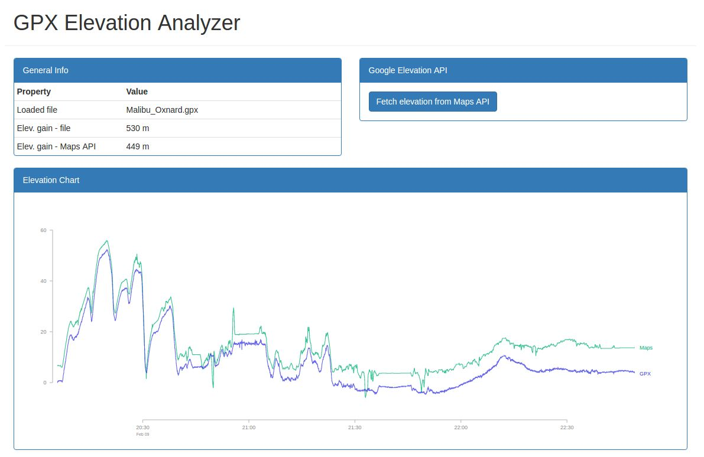

# GPX Elevation Analyzer

This is a small experiment to ~~compare elevation information between a GPX file and Google Maps API~~ display elevation information loaded from a GPX file (update 2021: the Google Elevation API no longer provides a free quota, so I am abandoning this feature).

The comparison with the Google Maps API was interesting to show how elevation data from Strava (used when you record your activity with the Strava app) gives elevation gains way higher than what one would see if recording with a cycling computer with a proper barometer.

If comparing it with a recording done with a cycling computer, however (screenshot above), it turns out the cycling computer seems more reliable.

## How to use

Clone the repo and install dependencies:

    cd gpx
    bower install

Then simply drop a GPX file into the drop zone.
